# Mediroza General Hospital — Web Application Penetration Test

**Tester:** Akinjolie Akintayo
**Target:** `medirozahospital.com`
**Engagement type:** Authorized black-box web application penetration test
**Environment:** Kali Linux

> Authorization note: This assessment was carried out with the hospital's full written approval. No data extracted during testing was used, retained, or disclosed beyond what was necessary to demonstrate risk to the client. Sensitive records referenced in this report (staff salaries, national IDs, shareholder holdings) have been redacted or sampled for this public write-up — the client received the complete, unredacted findings separately.

---

## 1. Executive Summary

This engagement assessed the security posture of Mediroza General Hospital's public-facing web presence, including its corporate site and patient portal. Testing followed a standard reconnaissance → enumeration → exploitation workflow.

The engagement uncovered **critical data exposure issues**. A hidden backup path disclosed via `robots.txt` led to a full, unauthenticated SQL database dump containing hospital staff records (names, job titles, national ID numbers, and monthly salaries) as well as the full shareholder register (names and shareholding percentages). Separately, patient pathology reports distributed through the patient portal were password-protected using weak, dictionary-crackable passwords, exposing confidential medical data.

**Overall risk to the client: Critical.** The combination of an exposed database backup and weak document encryption represents a severe breach of staff financial privacy, corporate governance confidentiality, and patient medical confidentiality (with associated POPIA/data-protection compliance exposure for a South African healthcare provider).

| Area | Result |
|---|---|
| Staff PII & salary data | Fully exposed |
| Shareholder register | Fully exposed |
| Patient pathology reports | Exposed via weak PDF passwords |
| Web Application Firewall | Present (LiteSpeed WAF) but did not prevent the above |
| Overall engagement risk | **Critical** |

---

## 2. Scope and Methodology

**Target:** `medirozahospital.com` (corporate site + patient portal at `/patient/portal.php`)

**Approach:** Black-box, external, unauthenticated testing — simulating an anonymous internet-based attacker with no prior credentials or insider knowledge.

**Methodology followed:**
1. Passive/active reconnaissance (DNS, WHOIS, OSINT)
2. Service and port enumeration
3. Web technology and WAF fingerprinting
4. Content discovery (`robots.txt`, hidden paths)
5. Exploitation of discovered exposure (data extraction)
6. Post-exploitation evidence review (metadata analysis, credential/password auditing)

**Limitations encountered:**
- theHarvester's Baidu-based OSINT pass returned no results (no indexed emails, hosts, or IPs) — source coverage for this engine was limited for this domain.
- Testing was external/black-box only; no internal network or authenticated staff-portal access was tested.
- Password auditing against the encrypted PDFs used a small, common-password dictionary (100 entries) for the initial pass; one file required a larger targeted wordlist including special-character patterns before it cracked.

---

## 3. Findings and Proof of Exploitation

### 3.1 Reconnaissance — DNS, WHOIS, and Network Footprint

- `nslookup medirozahospital.com` resolved the domain to `199.188.201.16`.
- `whois medirozahospital.com` confirmed registrar (NameCheap), registration dates, and nameservers — no privacy protection hiding infrastructure details.
- `nmap -sS medirozahospital.com` identified 13 open TCP ports, including `ftp (21)`, `smtp (25)`, `domain (53)`, `http/https (80/443)`, `pop3/imap (110/143)`, and their TLS variants — a broad attack surface for a service that only needs to expose 80/443 publicly.

**Evidence:**

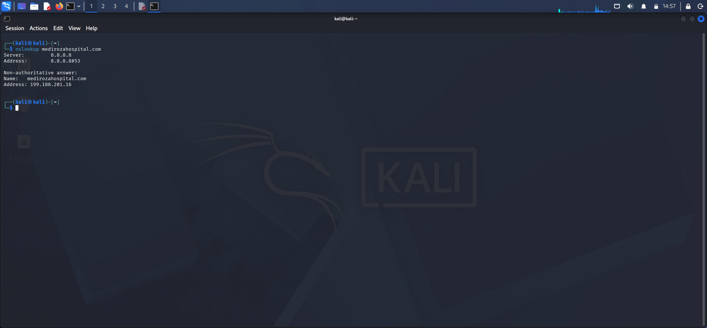
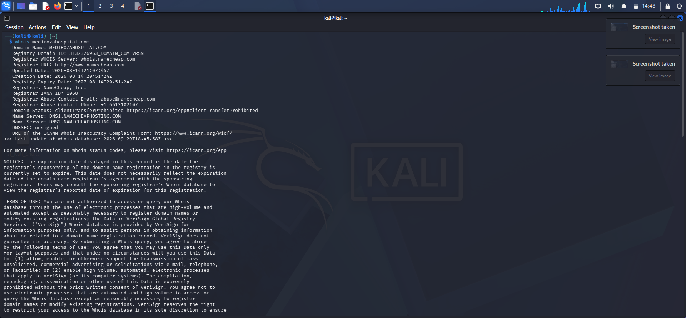
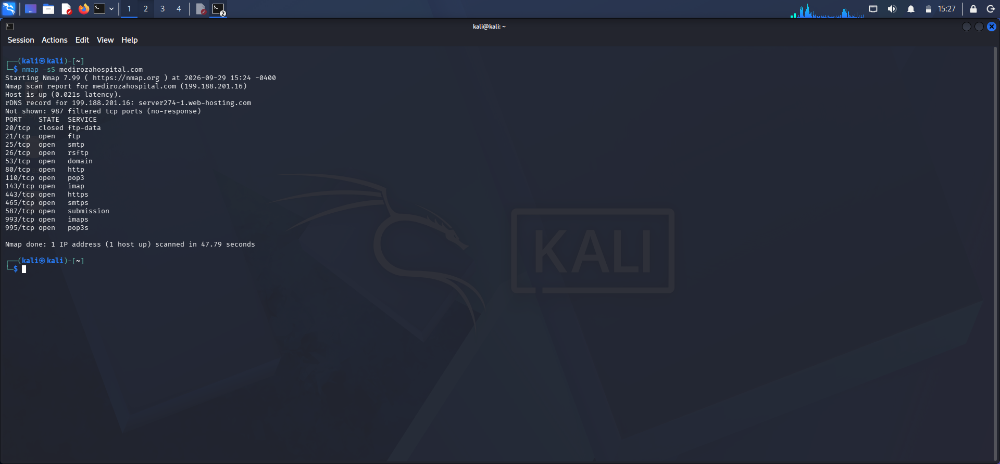

### 3.2 Web Technology & WAF Fingerprinting

- `whatweb medirozahospital.com` identified the stack as LiteSpeed, served over HTML5, with the root URL returning `403 Forbidden` directly (hardened) while the base domain 301-redirected to HTTPS.
- `wafw00f medirozahospital.com` confirmed the site sits behind a LiteSpeed WAF.
- `theHarvester -d medirozahospital.com -l 1000 -b baidu` returned no IPs, emails, people, or hosts for this source — OSINT footprint via this engine was minimal.

**Evidence:**

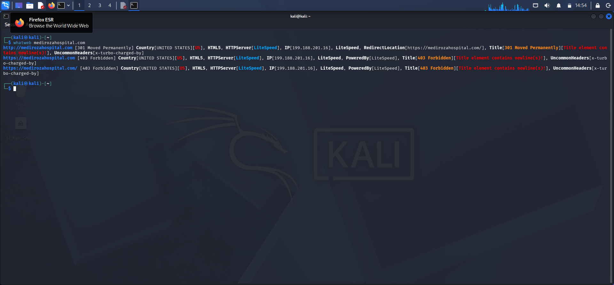
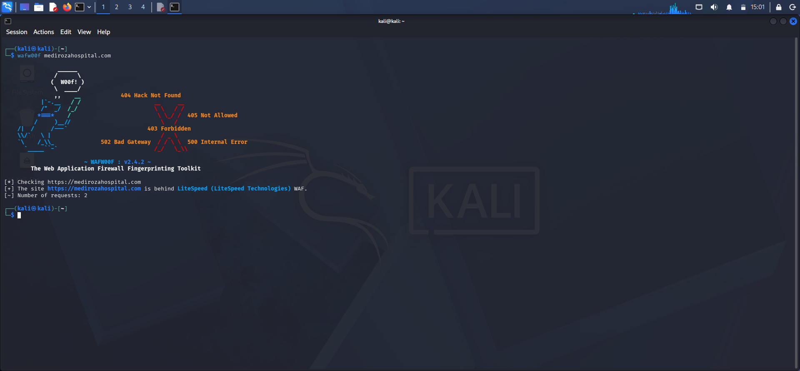
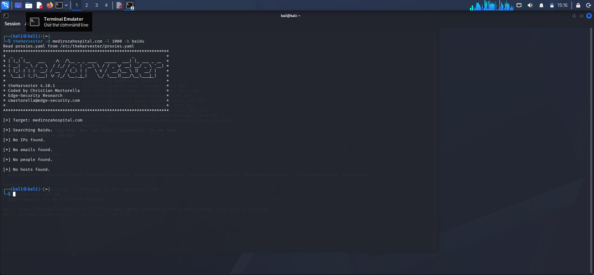

### 3.3 Critical — Sensitive Backup File Disclosure via `robots.txt`

`curl -s https://medirozahospital.com/robots.txt` revealed three disallowed directories: `/patient/`, `/staff/`, and `/old/`. While `robots.txt` is only a crawler convention and not an access control, the `/old/` entry flagged a legacy/backup path worth direct investigation — and it was directly reachable with no authentication.

Requesting the hidden path directly returned a **full raw SQL database export**, including complete `INSERT` statements for the `staff` and `shareholders` tables — i.e., a plaintext backup of production data sitting on a publicly reachable path.

**Exposed staff table fields:** `id, full_name, job_title, department, email, phone, national_id, monthly_salary_zar, date_joined` — approximately 30 staff records, from the Medical Director and CFO down to ward clerks.

**Exposed shareholders table fields:** `id, shareholder_name, share_percent, shares_held, share_class` — the complete cap table, including named individual shareholders and holding entities.

*Sample (redacted for this public report):*

| Name | Role | Salary band | National ID |
|---|---|---|---|
| Dr. R.N. | Chief Pathologist | R130k–R140k | `REDACTED` |
| ~~30 records total~~ | — | — | full set withheld from public repo |

| Shareholder | Share % |
|---|---|
| Dr. R.N. | 18.0% |
| Cedar Health Holdings (Pty) Ltd | 15.0% |
| ~~10 records total~~ | full set withheld from public repo |

**Evidence:**

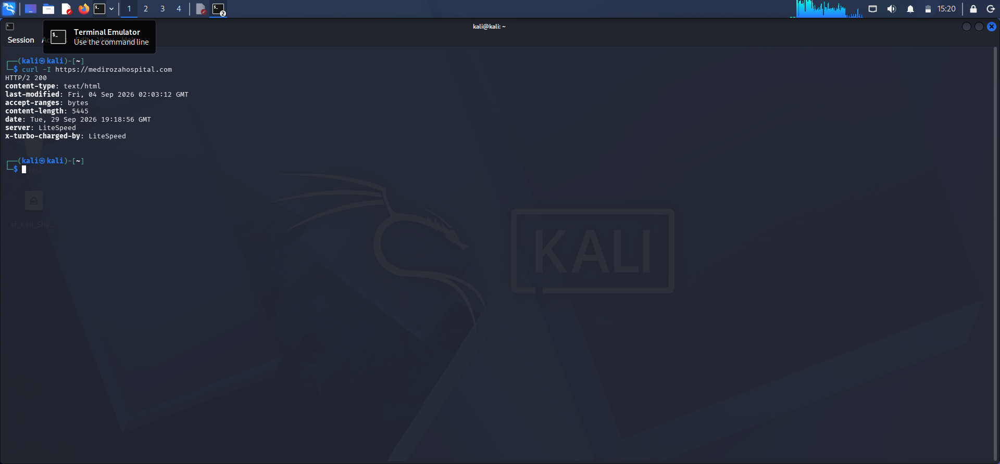
*`robots.txt` disclosing the hidden `/old/` path*

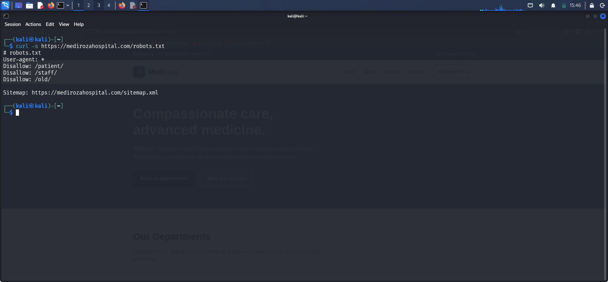
*Direct, unauthenticated request to the hidden path*

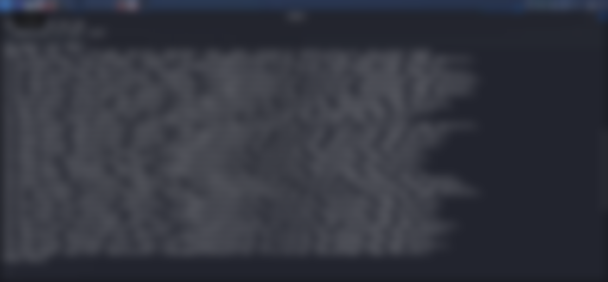
*Dumped `staff` table — blurred in this public copy; full detail withheld from the public repo*

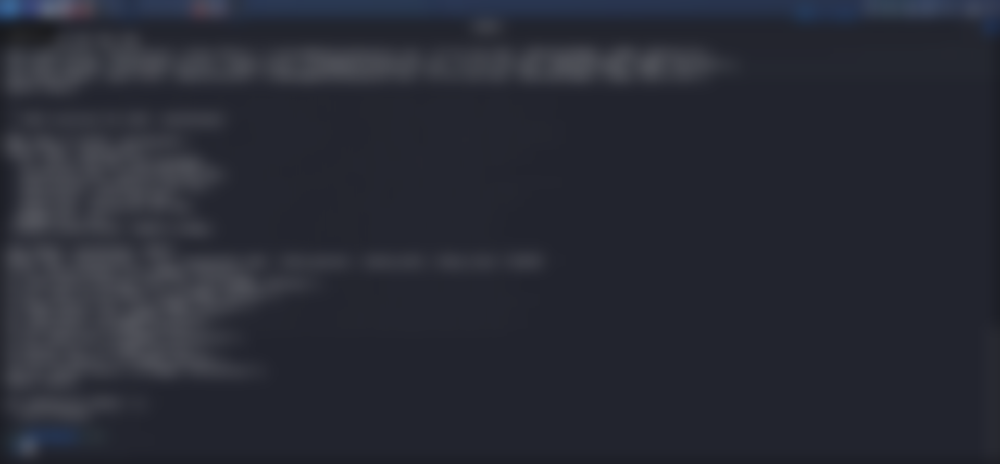
*Dumped `shareholders` table — blurred in this public copy; full detail withheld from the public repo*

### 3.4 High — Weak Password Protection on Patient Pathology Reports

The patient portal (`/patient/portal.php`) allowed download of password-protected pathology PDF reports ("My lab reports"), with the UI stating reports are "password protected" and the password is sent separately to the patient.

Three sample reports were downloaded and audited:

| File | Patient | Password | Crack method |
|---|---|---|---|
| `patient_report_1.pdf` | S. Dlamini | `123456` | Dictionary attack, matched at attempt 1/100 |
| `patient_report_2.pdf` | P. Reddy | `password` | Dictionary attack, matched at attempt 2/100 |
| `patient_report_3.pdf` | E. Thompson | `!@#$%^&` | Dictionary attack — not in the initial 100-word list (`ACCESS DENIED` on first pass), cracked after loading a larger/targeted wordlist (3,546/3,556 attempts) |

The PDF encryption used was standard PDF `R3`/128-bit RC4 encryption — cryptographically it's fine, but the *passwords* chosen by the hospital's reporting system (`123456`, `password`, and a short special-character string) were trivially guessable, which defeats the protection entirely. `exiftool` extraction of the decrypted files also confirmed the internal metadata (`Mediroza CMS 1.4.2`, author, subject, patient name) was fully readable once unlocked, confirming genuine PHI exposure, not just a cosmetic lock.

**Evidence:**

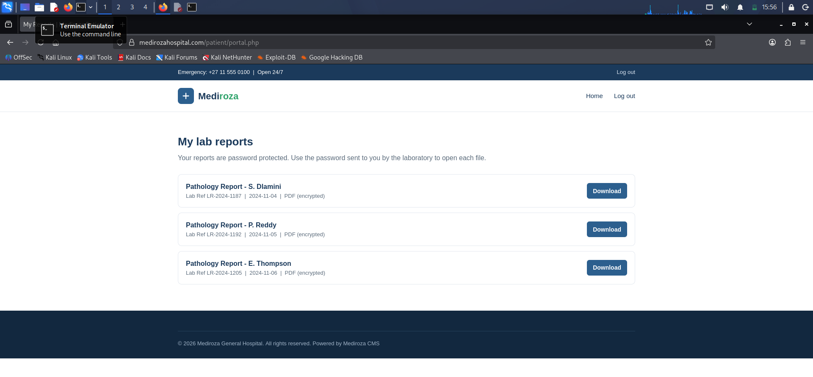
*Patient portal listing encrypted lab reports available for download*

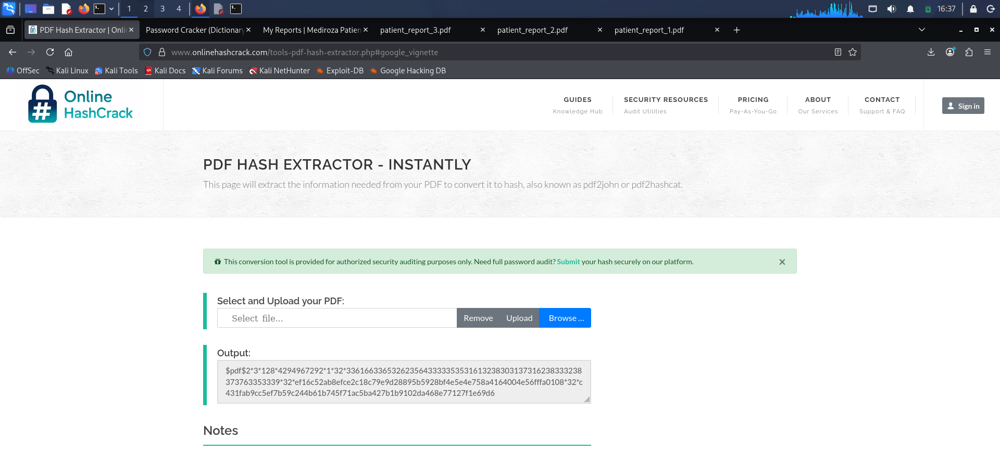
*Extracting the PDF password hash for cracking*

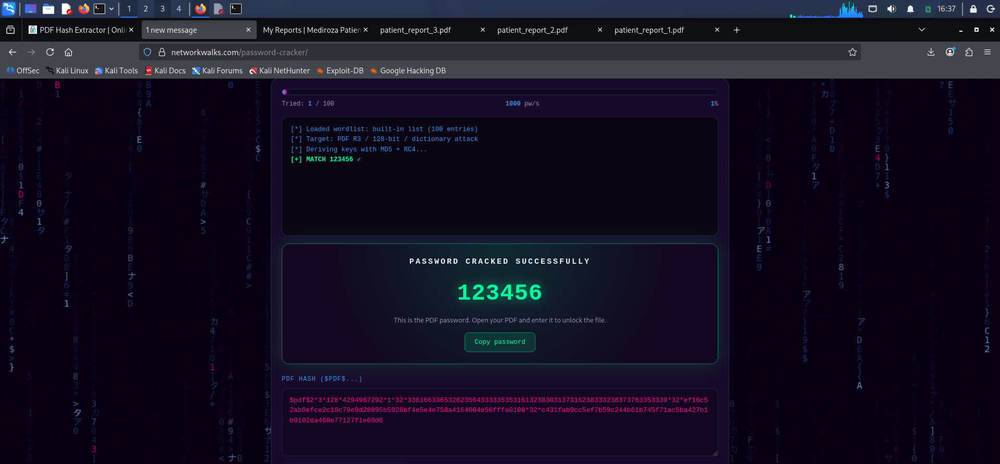
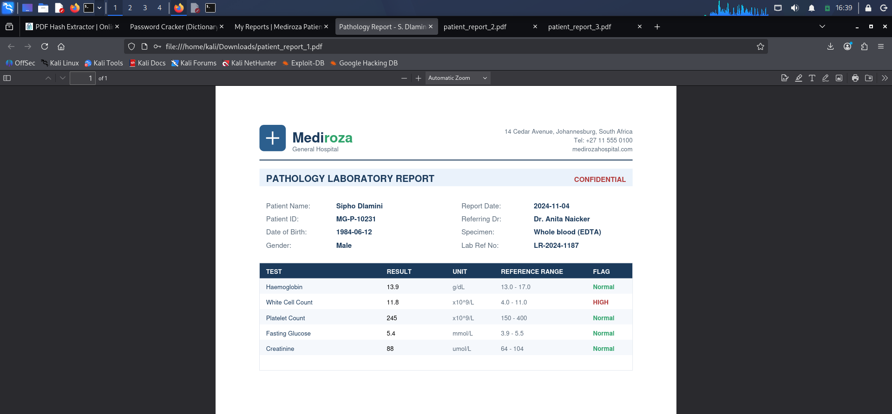
*`patient_report_1.pdf` — password cracked and file opened*

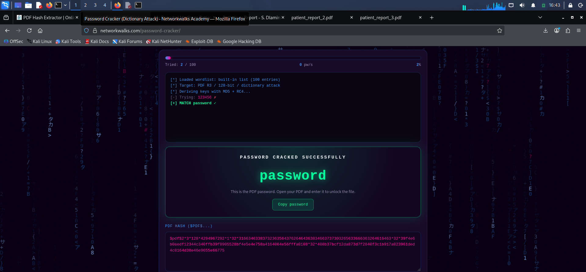
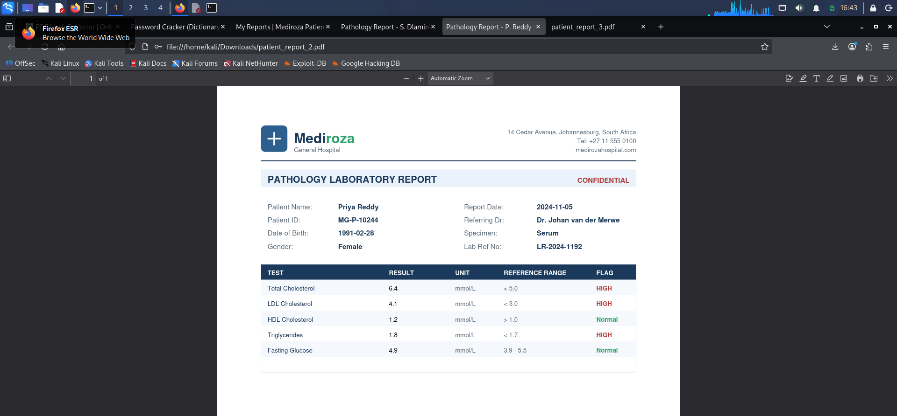
*`patient_report_2.pdf` — password cracked and file opened*

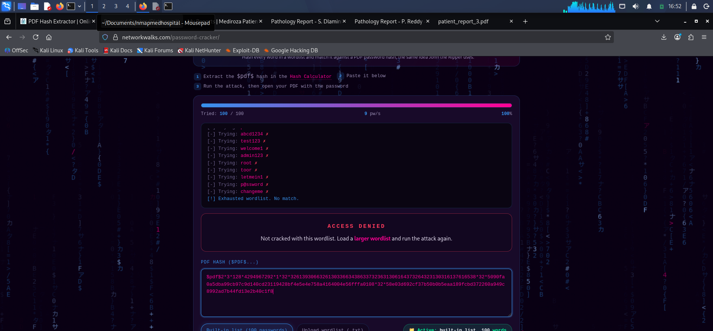
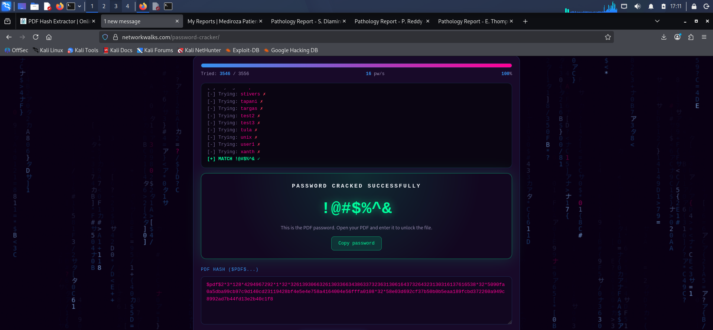
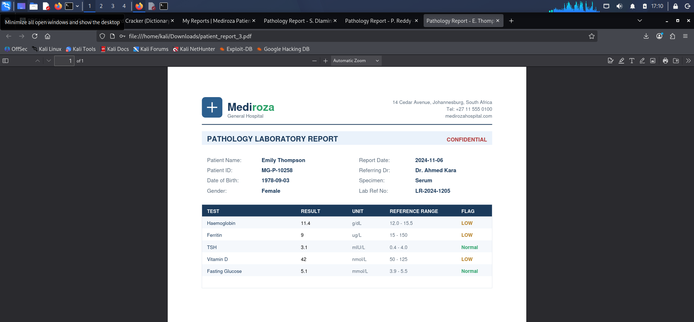
*`patient_report_3.pdf` — resisted the initial wordlist, cracked with a larger/targeted list*

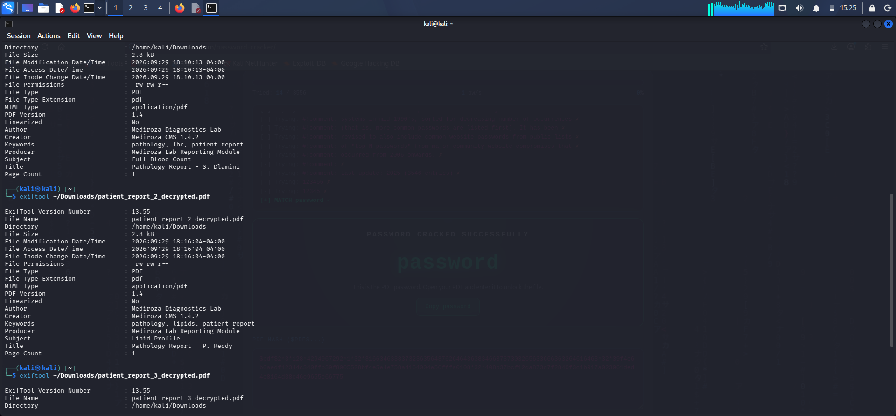
*Confirming decrypted PDF metadata (author, subject, patient name)*

---

## 4. Risk Rating

| # | Finding | Rating | Justification |
|---|---|---|---|
| 1 | Publicly accessible database backup (`/old/` path) exposing staff PII, salaries, and shareholder register | **Critical** | Unauthenticated, complete exfiltration of highly sensitive financial and personal data (salaries, national IDs, cap table) with no exploitation skill required beyond following a disclosed path. Direct GDPR/POPIA-class compliance and reputational impact. |
| 2 | Weak/default passwords on patient-facing encrypted PDF reports | **High** | Confidential patient health information (PHI) protected only by a guessable password; two of three sampled files used top-10 common passwords. Directly undermines the portal's stated confidentiality control. |
| 3 | Broad open port footprint (FTP, SMTP, POP3/IMAP, DNS, and TLS variants all internet-facing) | **Medium** | Increases attack surface beyond what a public web service requires; no direct exploitation achieved during this engagement, but each service is a potential future entry point if misconfigured or unpatched. |
| 4 | `robots.txt` disclosing sensitive directory names (`/staff/`, `/patient/`, `/old/`) | **Low–Medium** | Not a vulnerability by itself, but it signposted the path that led directly to Finding 1 — classic reconnaissance assist for an attacker. |

---

## 5. Recommendations and Remediation

**Finding 1 — Exposed backup file:**
- Immediately remove the `/old/` directory (and any other legacy paths) from the public web root; backups must never be stored inside a publicly served directory.
- Move all database backups to storage outside the web server's document root, encrypted at rest, with access restricted by authentication and IP allow-listing.
- Rotate all exposed credentials/IDs where feasible and review whether affected staff and shareholders require formal breach notification under applicable data-protection law.
- Add automated scanning (e.g., scheduled content-discovery scans) to catch publicly exposed backup/config files before attackers do.

**Finding 2 — Weak PDF passwords:**
- Replace the current password-generation logic in the Mediroza CMS reporting module with a scheme that generates long, random, unique passwords per report (not shared dictionary words).
- Deliver the password via a genuinely separate, authenticated channel (e.g., OTP to the patient's verified phone/email at download time) rather than a static, reusable password.
- Consider moving away from password-protected PDFs entirely in favor of authenticated, session-based document access within the patient portal.

**Finding 3 — Unnecessary open services:**
- Audit each open port (FTP, SMTP, POP3, IMAP, and their TLS equivalents) and close or firewall off any service not required to be internet-facing.
- Where mail services are required, restrict them to known relay/client IP ranges rather than the open internet.

**Finding 4 — `robots.txt` disclosure:**
- Avoid listing sensitive path names in `robots.txt`. Enforce access control on sensitive directories directly (authentication/authorization) rather than relying on crawler directives, which are advisory only and commonly reviewed by attackers.

---

## Tools Used (Kali Linux)

| Tool | Purpose |
|---|---|
| `nslookup` | DNS resolution / initial footprinting |
| `whois` | Domain registration and infrastructure recon |
| `nmap` | TCP port and service scanning |
| `whatweb` | Web technology stack fingerprinting |
| `wafw00f` | Web Application Firewall detection |
| `theHarvester` | OSINT gathering (emails, hosts, people) |
| `curl` | HTTP header inspection, `robots.txt` enumeration, direct retrieval of the exposed backup file |
| `exiftool` | Metadata extraction/verification from decrypted PDF reports |
| John the Ripper / Hashcat–style PDF hash cracking (`pdf2john` workflow) | Dictionary attack against password-protected patient PDF reports |

---

## Repository Structure

```
mediroza-pentest-report/
├── README.md              <- this report
└── evidence/               <- screenshots referenced above
    ├── nslookup_medirozahospital.png
    ├── whois_medirozahospital.png
    ├── nmap_medirozahospital.png
    ├── whatweb_medirozahospital.png
    ├── watw00f_medirozahospital.png
    ├── theHarvester_medrizohospital.png
    ├── curl_medirozahospital.png
    ├── curlmedirozahospital_hidden.png
    ├── curlmedhospital_staffsalary.png
    ├── curlmedirozahospital_shareholders.png
    ├── medirozalogin.png
    ├── exiftool_medirozahospital.png
    └── file1/file2/file3 (cracked/opened/access-denied) screenshots
```

---

*Disclaimer: This report is shared for portfolio/educational purposes. All sensitive data belonging to the assessed organization has been redacted or sampled. This assessment was conducted under explicit written authorization from Mediroza General Hospital.*
